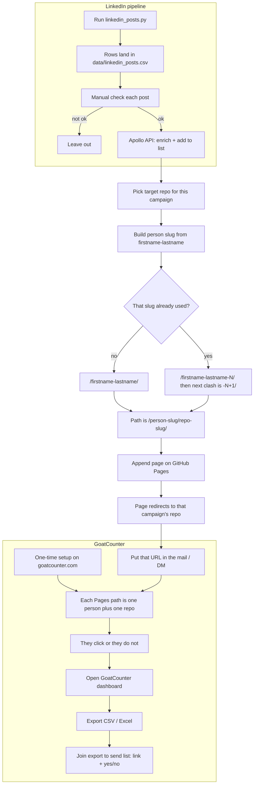

# flowchart

```mermaid
flowchart TD
  subgraph P1["LinkedIn pipeline"]
    L1[Run linkedin_posts.py] --> L2[Rows land in data/linkedin_posts.csv]
    L2 --> L3[Manual check each post]
    L3 -->|not ok| L4[Leave out]
    L3 -->|ok| L5[Apollo API: enrich + add to list]
  end

  L5 --> M1[Pick target repo for this campaign]
  M1 --> M2[Build person slug from firstname-lastname]
  M2 --> M3{That slug already used?}
  M3 -->|no| M4["/firstname-lastname/"]
  M3 -->|yes| M5["/firstname-lastname-N/ then next clash is -N+1/"]
  M4 --> M6["Path is /person-slug/repo-slug/"]
  M5 --> M6
  M6 --> M7[Append page on GitHub Pages]
  M7 --> M8[Page redirects to that campaign's repo]
  M8 --> M9[Put that URL in the mail / DM]

  subgraph P3["GoatCounter"]
    G1[One-time setup on goatcounter.com]
    G1 --> G2[Each Pages path is one person plus one repo]
    M9 --> G2
    G2 --> G3[They click or they do not]
    G3 --> G4[Open GoatCounter dashboard]
    G4 --> G5[Export CSV / Excel]
    G5 --> G6[Join export to send list: link + yes/no]
  end
```
