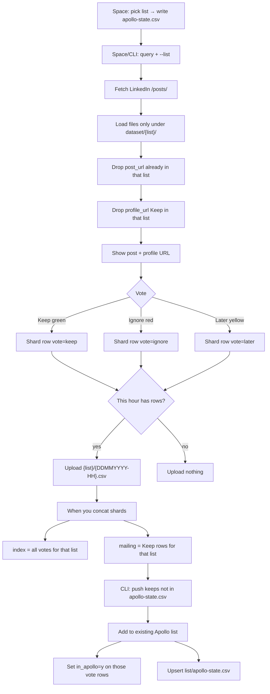

# flowchart limited

Space dashboard + dataset shards + Apollo. Skip is per Apollo list directory only.

```mermaid
flowchart TD
  L0["Space: pick list → write apollo-state.csv"] --> L1["Space/CLI: query + --list"]
  L1 --> L2[Fetch LinkedIn /posts/]
  L2 --> L3["Load files only under dataset/{list}/"]
  L3 --> L4[Drop post_url already in that list]
  L4 --> L5[Drop profile_url Keep in that list]
  L5 --> L6[Show post + profile URL]
  L6 --> L7{Vote}
  L7 -->|Keep green| L8[Shard row vote=keep]
  L7 -->|Ignore red| L9[Shard row vote=ignore]
  L7 -->|Later yellow| L10[Shard row vote=later]
  L8 --> L11{This hour has rows?}
  L9 --> L11
  L10 --> L11
  L11 -->|yes| L12["Upload {list}/{DDMMYYYY-HH}.csv"]
  L11 -->|no| L13[Upload nothing]
  L12 --> L14[When you concat shards]
  L14 --> L15[index = all votes for that list]
  L14 --> L16[mailing = Keep rows for that list]
  L16 --> L17[CLI: push keeps not in apollo-state.csv]
  L17 --> L18[Add to existing Apollo list]
  L18 --> L19[Set in_apollo=y on those vote rows]
  L18 --> L20[Upsert list/apollo-state.csv]

```
